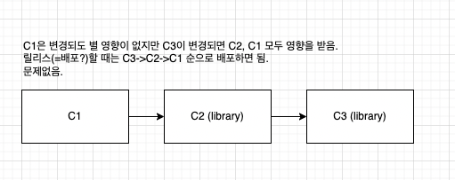
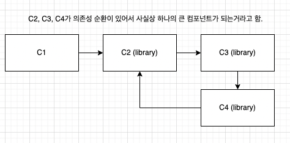
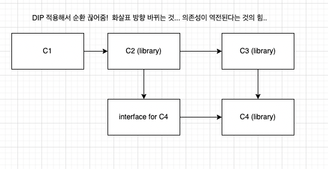

- SOLID 원칙이 방에 벽돌을 배치하는 방법이라면, 컴포넌트 원칙은 빌딩에 방을 배치하는 방법이라고 함!

### ch 12. 컴포넌트
- 컴포넌트는 배포 단위라고 함
- 컴포넌트의 간략한 역사...는 몰라도 될듯?
- 요약하면 컴퓨터 성능이 좋아져서 많은 라이브러리를 플러그인할 수 있는 형태가 되었다고 함.
  
  그래서 .jar 파일같은 라이브러리를 플러그인 형태로 배포하는게 자연스러워졌다고 함.

### ch 13. 컴포넌트 응집도
- **클래스를 어떤 모듈에 위치시킬지에 대한 내용.**

- 컴포넌트 응집도와 관련된 세 가지 원칙이 있다고 함.. (이런 접근은 좀 싫은데)
  1. REP: Reuse/Release Equivalence Principle
     - 재사용 단위는 릴리스 단위와 같다?
     - 컴포넌트(라이브러리)를 구성하는 모든 모듈은 서로 공유하는 중요한 목적이 있어야 한다고 함 

  2. CCP: Common Closure Principle
      - `SRP`에서 클래스의 변경 이유가 유일해야 한다고 말했듯이, `CCP`에서 컴포넌트의 변경 이유도 유일해야 한다고 함.. 
      - CCP는 같은 이유로 변경될 것 같은 클래스를 한곳으로 묶을 것을 권한다고 함.
    
        근데 MSA에서는 컴포넌트 간에 메시지를 주고받으며 여러 컴포넌트가 관련되니까 지키기 힘든듯.

  3. CRP: Common Reuse Principle
      - 같이 재사용되는 경향이 있는 클래스와 모듈은 같은 컴포넌트에 위치시키라고 함.
      - `ISP`가 사용하지 않는 메서드가 있는 클래스에 의존하지 말라고 하듯이, `CRP`는 사용하지 않는 클래스가 있는 컴포넌트에 의존하지 말라고 조언함.

- REP, CCP, CRP 사이에서 적절히 tension을 유지하라고 함.
  
  보통 초기에는 CCP, CRP 위주로 컴포넌트 구조를 잡고 REP를 챙기는 식으로 발전한다고 함..

### ch 14. 컴포넌트 결합
- **컴포넌트 사이의 관계(=의존성)에 대한 원칙 3가지**

1. ADP: 의존성 비순환 원칙
   - 컴포넌트 `의존성 그래프`에 순환이 있으면 안 된다고 함. 왜?
   
    
    
    

   - 컴포넌트 의존성 그래프는 결국 자주 변경되는 컴포넌트로부터 가치가 높은, 안정된 컴포넌트를 보호하는 아키텍트로 된다고 함. 

3. SDP: 안정된 의존성 원칙
   - 더 안정된 쪽에 의존하라고 함
   - 대충 말하면 여러 컴포넌트가 의존하면 안정된 컴포넌트, 여러 컴포넌트에 의존하면 불안정한 컴포넌트..
   - 안정성 측정 지표도 있는데.. 생략.
   - 자주 변경하도록 설계한 컴포넌트(불안정한)가 의존성이 생기면 이 때도 `DIP`로 풀 수 있음.

4. SAP: 안정된 추상화 원칙
   - `업무로직`(고수준 정책)을 캡슐화한 컴포넌트는 반드시 `안정된` 상태여야 한다고 함

     근데 고수준 정책을 안정된 컴포넌트에 위치시키면, 변경하기 어려워짐

     안정된 상태이면서 동시에 변경에 대응하기 쉽게 만들어야 한다고 함.

   - 컴포넌트는 안정된 정도만큼만 추상화되어야 한다??

     SAP는 안정성과 추상화 정도 사이의 관계를 정의한다고 함.

     안정된 컴포넌트는 추상 컴포넌트여야 하고, 불안정한 컴포넌트는 구체 컴포넌트여야 한다고 함..! (실천해본 적 없음)

   - `Main Sequence` 아이디어는 나중에 보자...